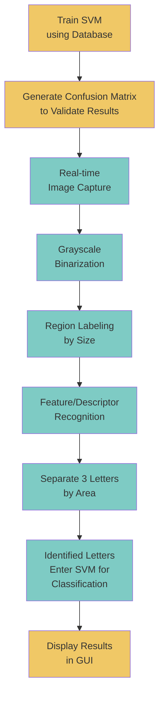
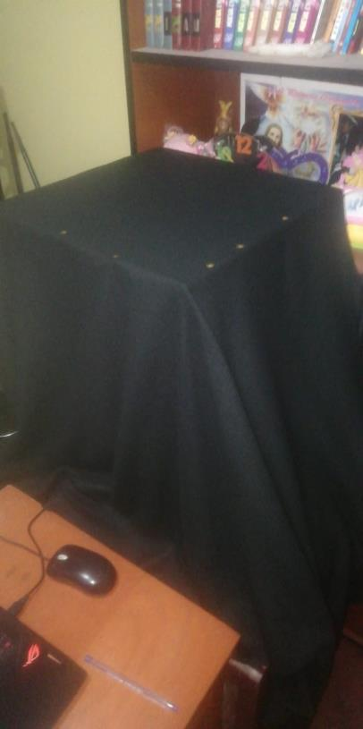
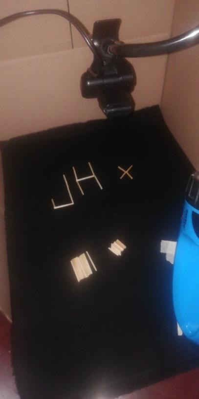
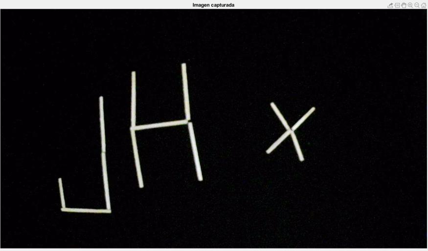
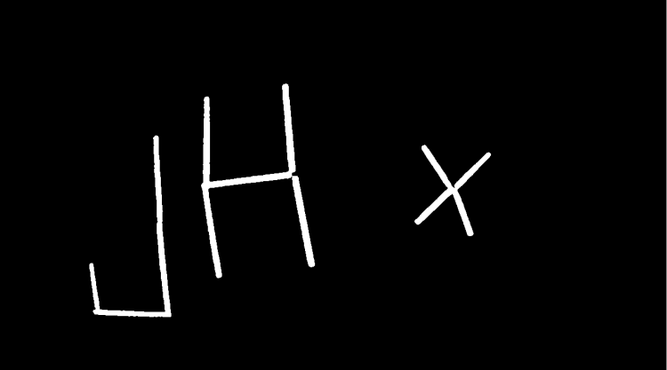
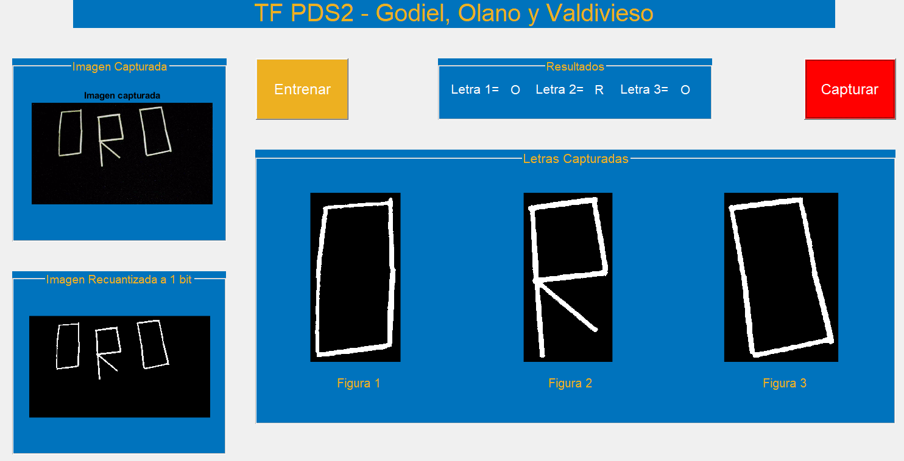
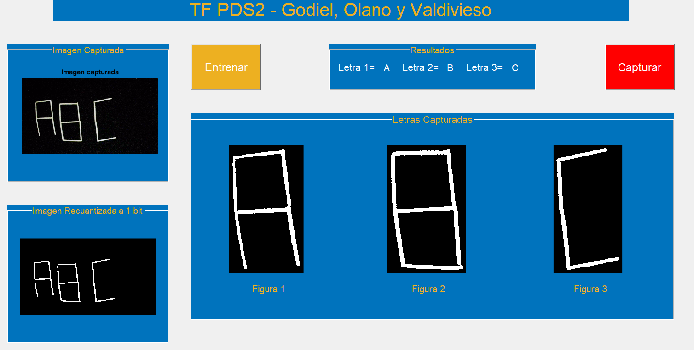
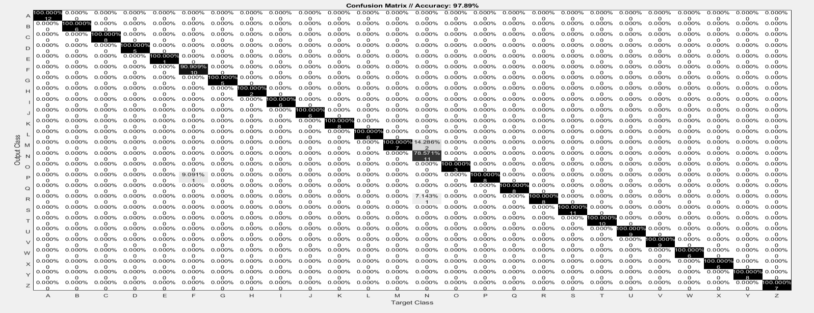

# Letter Recognition System with SVM

Uppercase letter recognition system (A-Z) formed with matchsticks, using image processing and Machine Learning.

> **University Project** - Advanced Signal and Image Processing (PDS2) - UPC, Peru, 2021

## System Overview

This system captures real-time images through a webcam, processes them to detect letters formed with matchsticks, and classifies them using a Support Vector Machine (SVM).



## Hardware Setup

The acquisition system consists of a Full HD 1080p webcam mounted inside a controlled enclosure to ensure consistent lighting conditions.

| Acquisition Enclosure | Interior View |
|:---------------------:|:-------------:|
|  |  |

## Image Processing Pipeline

### 1. Image Capture
Raw image captured from the webcam showing matchstick letters:



### 2. Binarization
Conversion to 1-bit binary image for segmentation:



### 3. Segmentation & Classification
8-connectivity labeling separates individual letters, followed by feature extraction and SVM classification.

## GUI Application

The MATLAB GUIDE interface provides real-time letter recognition:

| Demo: O-R-O | Demo: A-B-C |
|:-----------:|:-----------:|
|  |  |

**Features:**
- **Entrenar** (Train): Train the SVM model with the database
- **Capturar** (Capture): Capture and classify 3 letters in real-time
- Shows captured image, binarized image, and individual segmented letters

## Results

The SVM classifier achieves **97.89% accuracy** on the validation set:



## Technical Details

| Component | Description |
|-----------|-------------|
| Acquisition | Full HD 1080p Webcam in controlled enclosure |
| Preprocessing | Grayscale conversion + 1-bit binarization |
| Segmentation | 8-connectivity labeling |
| Features | Area, Perimeter, Major/Minor axes, Upper/Lower area |
| Classifier | Multiclass SVM (RBF kernel, One-vs-One strategy) |
| Validation | K-Fold (K=5), 70% training / 30% validation |

## File Structure

```
├── TF_PDS2_Godiel_Olano_Valdivieso.m    # Main code with GUI
├── TF_PDS2_Godiel_Olano_Valdivieso.fig  # GUIDE graphical interface
├── trainClassifierSVM.m                  # SVM training function
├── plotConfMat2.m                        # Confusion matrix visualization
├── TF PDS2.mat                           # Training database
├── images/                               # Project images
└── *.pdf                                 # Project documentation (Spanish)
```

## Requirements

- MATLAB R2019b or higher
- Image Processing Toolbox
- Statistics and Machine Learning Toolbox
- Compatible webcam

## Usage

1. Open MATLAB and navigate to project folder
2. Run `TF_PDS2_Godiel_Olano_Valdivieso`
3. Click **"Entrenar"** (Train) to train the SVM model
4. Place 3 letters made with matchsticks in the enclosure
5. Click **"Capturar"** (Capture) to recognize the letters

## Limitations

- Detects exactly 3 letters simultaneously
- Letters must be separated from each other
- No rotation support
- Requires controlled lighting conditions

## Team

- Jorge Ronaldo Godiel Galvez
- Bryan Giomar Valdivieso Becerra
- Luis Harold Olano Tejada

## Note

This is an academic project from 2021. The techniques used (SVM with handcrafted features, MATLAB GUIDE) represent the course curriculum at that time. For modern applications, consider using Deep Learning approaches with Python/OpenCV/PyTorch.

## License

Educational project - UPC 2021
